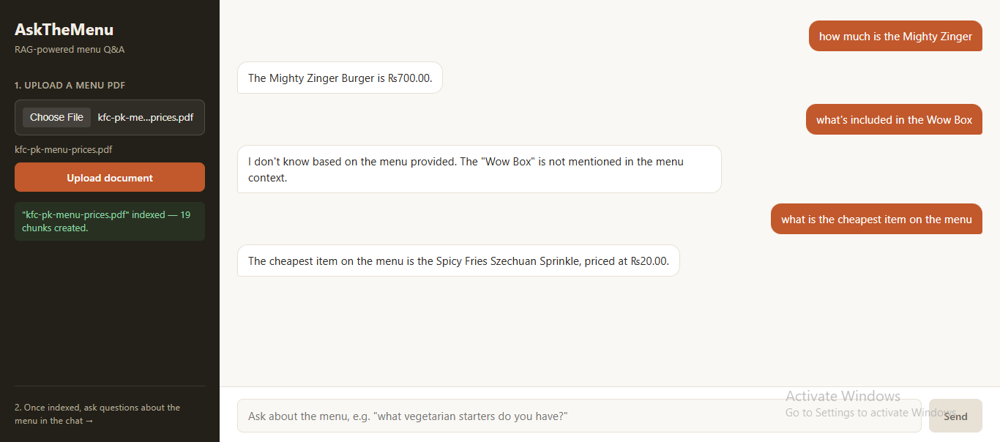

# AskTheMenu 🍗

A RAG (Retrieval-Augmented Generation) chatbot that answers questions about a restaurant menu, grounded strictly in the uploaded menu PDF — no hallucinated prices or items.

Built as a learning project to understand how RAG pipelines work end to end: PDF parsing → chunking → embeddings → vector search → grounded generation.

## Demo



The bot correctly answers questions from the menu (*"The Mighty Zinger Burger is ₨700.00"*), correctly refuses to answer when something isn't on the menu (*"I don't know based on the menu provided"* for an item that doesn't exist), and can reason across multiple items (*finding the cheapest item on the menu*).

## How It Works

```
PDF Upload → Text Extraction → Duplicate Cleanup → Chunking
    → Embeddings (Gemini) → Stored in ChromaDB

User Question → Question Embedding → Cosine Similarity Search
    → Top Matching Chunks → Gemini generates a grounded answer
```

If the answer isn't in the menu, the bot says so instead of making something up — that's the core idea behind RAG.

## Tech Stack

**Backend**
- Python, FastAPI
- `pdfplumber` — PDF text extraction
- LangChain `RecursiveCharacterTextSplitter` — text chunking
- Google Gemini API — embeddings + generation
- ChromaDB — local vector database

**Frontend**
- React + Vite
- Plain CSS (no framework)

## Features

- Upload any restaurant menu PDF
- Ask natural-language questions about prices, items, and combos — in English or Roman Urdu
- Refuses to answer questions not covered by the menu (grounded, not hallucinated)
- Clean chat interface with upload sidebar

## Project Structure

```
ask-the-menu/
├── main.py              # FastAPI app — routes, CORS, validation
├── rag_utils.py          # Core RAG pipeline logic (heavily commented)
├── requirements.txt
├── .env.example
└── frontend/
    ├── src/
    │   ├── App.jsx        # Main app state
    │   ├── api.js          # Backend API calls
    │   └── components/
    │       ├── Sidebar.jsx
    │       └── ChatArea.jsx
    └── package.json
```

## Running Locally

### Backend

```bash
git clone https://github.com/fazeensaleem17-byte/rag-menu-chatbot.git
cd rag-menu-chatbot

python -m venv venv
venv\Scripts\activate      # Windows
# source venv/bin/activate  # Mac/Linux

pip install -r requirements.txt

cp .env.example .env
# open .env and add your Gemini API key
```

```bash
uvicorn main:app --reload --port 8000
```

Backend runs at `http://localhost:8000` — interactive docs at `http://localhost:8000/docs`

### Frontend

```bash
cd frontend
npm install
npm run dev
```

Frontend runs at `http://localhost:5173`

## Getting a Gemini API Key

1. Go to [aistudio.google.com/apikey](https://aistudio.google.com/apikey)
2. Sign in with a Google account
3. Click "Create API key"
4. Paste it into your `.env` file as `GOOGLE_API_KEY=your_key_here`

## What I Learned

This was my first RAG project. Key things I ran into and learned from:

- **Chunking can split related information apart.** An item's name and its price can land in different chunks if a chunk boundary falls between them, causing the bot to miss information that's technically in the data.
- **`top_k` is a trade-off.** Retrieving more chunks reduces the chance of missing the right one, but increases cost — and a fix that *looks* like it worked can still be a false positive if the model is only guessing near the right answer.
- **Source data quality matters more than model tuning.** My first menu PDF was a scraped web page with corrupted, duplicated text. Switching to a clean, properly structured source PDF fixed accuracy issues no amount of prompt or retrieval tuning could.
- **Grounded refusal is the whole point.** The bot correctly saying "I don't know" for out-of-menu questions (rather than confidently guessing a wrong price) is what separates RAG from a plain chatbot — and is the single most important thing to test for.

## License

This is a personal learning project.
